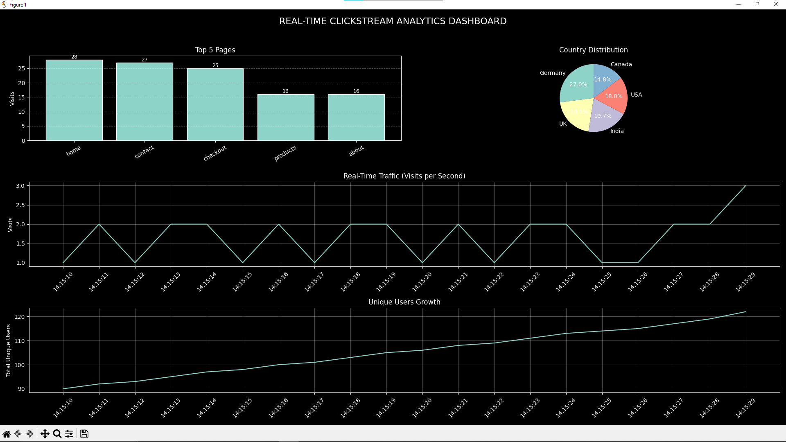
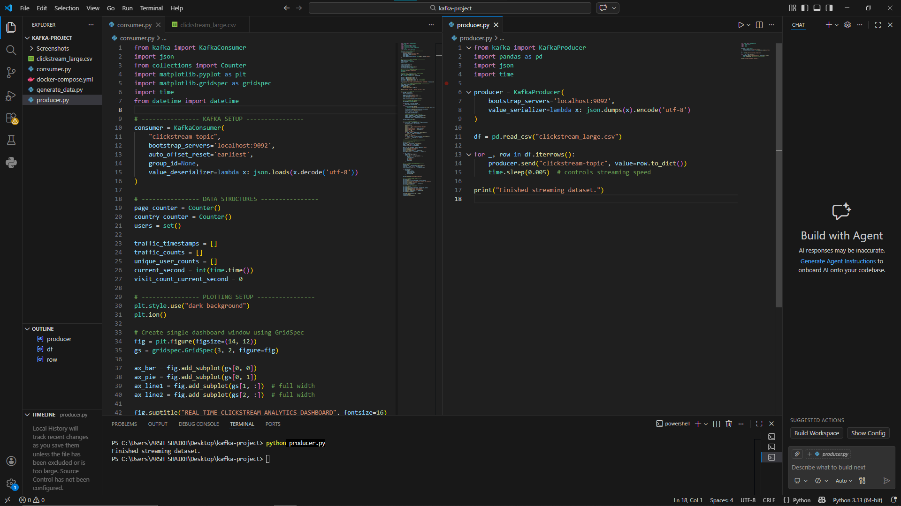

# Real-Time Clickstream Analytics Dashboard

## Overview
A real-time website traffic analytics dashboard built using Apache Kafka, Python, and Matplotlib. The system simulates clickstream traffic data, streams it through Kafka, and visualizes analytics in real time.


## Features
- Real-time clickstream data streaming
- Apache Kafka Producer & Consumer architecture
- Live traffic analytics dashboard
- Country-wise traffic distribution
- Unique user growth tracking
- Real-time graph visualizations
- Docker-based Kafka setup

## Technologies Used
- Python
- Apache Kafka
- Docker
- Pandas
- Matplotlib
- NumPy

---

## Screenshots

### Real-Time Dashboard


### System Running in VS Code


---

## Project Structure

```plaintext
kafka-project/
│
├── consumer.py
├── producer.py
├── generate_data.py
├── docker-compose.yml
├── screenshots/
└── README.md
```

---

## How to Run

### Start Kafka
```bash
docker compose up -d
```

### Create Topic
```bash
docker exec -it kafka /opt/kafka/bin/kafka-topics.sh --create --topic clickstream-topic --bootstrap-server localhost:9092
```

### Generate Dataset
```bash
python generate_data.py
```

### Run Producer
```bash
python producer.py
```

### Run Consumer Dashboard
```bash
python consumer.py
```

---

## Future Improvements
- Web-based dashboard
- Spark Streaming integration
- Database storage
- Session analytics
- User behavior prediction

## Author
Arsh Shaikh
